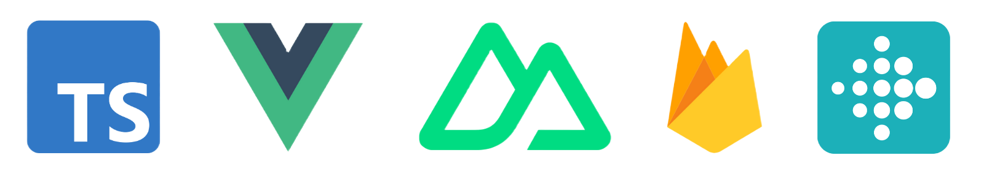

# KUL Health Monitoring Web App

This is a restyling of the initial version of my gamified health tracking web app for my thesis.
For this I've switched to nuxtjs as my framework using Dian Pratama's [template](https://github.com/dianprata/nuxt-shadcn-dashboard).

## Credits

- [Dian Pratama](https://github.com/dianprata/nuxt-shadcn-dashboard)
- [Nuxt.js](https://nuxtjs.org/)
- [Shadcn Vue](https://shadcn-vue.com/)
- [UnoCSS](https://unocss.com/)

## License

MIT

[nuxt-src]: https://img.shields.io/badge/Built%20With%20Nuxt-18181B?logo=nuxt.js
[nuxt-href]: https://nuxt.com/

---

# Gamified Health Platform for Fitbit Users

This repository contains the source code for a custom-built gamified web platform designed for a behavioural intervention study on physical activity and well-being. The platform integrates with Fitbit Inspire 2 devices and provides daily/weekly quests (or challenges), badges (or lifetime quests), XP and coin rewards, a shop, a leaderboard, and avatar customisation to enhance user motivation.

## Overview

This project was developed as part of a master's thesis titled:
**"Utilising Wearable Technology to Create a Gamified Intervention for Well-Being in an Urban Environment."**

The goal was to investigate whether gamified digital feedback loops could increase physical activity among university students using real-time wearable data.

The website was developed during February 2025 - May 25th 2025. The experiment ran from May 12th 2025 - June 17th.

## Features

- Fitbit integration via OAuth 2.0
- Daily and weekly quests
- XP and coin system
- Avatar and theme customisation (shop)
- Badge system (progress milestones)
- Leaderboard displaying XP rankings and cosmetic status
- Firebase-based user authentication and state storage

## Technologies Used

- **Frontend:** Nuxt.js (Vue 3), TypeScript
- **Backend:** Firebase (Firestore, Firebase Auth)
- **API Integration:** Fitbit Web API (OAuth 2.0)
- **Styling & UI:** Tailwind CSS



## Installation & Setup

> [!NOTE] <br>
> This platform was developed for research purposes and may not be fully production-ready.

> Follow these steps to run the project **locally**:

1. **Clone the repository**:

   ```bash
   git clone https://github.com/Frederik-Goedkoop-73/your-repo-name.git
   cd your-repo-name # Navigate to new directory with the repo
   ```

2. **Install dependencies**:

   ```bash
   npm install
   ```

3. **Generate the Nuxt build files** (this will fix the `.nuxt/tsconfig.server.json` error):

   ```bash
   npm run build
   ```

4. **Environment Variables**:

   Create a `.env` file based on `.env.example` and add the following:

   ```
   NUXT_PUBLIC_FIREBASE_API_KEY=your_key
   NUXT_PUBLIC_FIREBASE_AUTH_DOMAIN=your_project.firebaseapp.com
   NUXT_PUBLIC_FIREBASE_PROJECT_ID=your_project_id
   NUXT_PUBLIC_FITBIT_CLIENT_ID=your_client_id
   ...
   ```

5. **Start the development server**:

   > [!WARNING] <br>
   > The website won't work unless a .env file is created!

   ```bash
   npm run dev
   ```

   Copy the localhost url from the terminal into a new browser tab to open the website.

6. **Fitbit OAuth Setup**:

   - You must register your app at [https://dev.fitbit.com](https://dev.fitbit.com) and add `http://localhost:3000` as a redirect URI.
   - Use the Fitbit Client ID in your `.env` file.
   - For a public setup you will need to register another app and insert the hosted website's URL as the redirect URI.

## Usage Instructions

- Users log in using their Google account and connect their Fitbit account via OAuth.
- Upon login, Fitbit data is pulled and used to generate quest progress.
- Users can complete and collect quests, earn XP/coins, and unlock avatars.
- Quest rewards must be collected manually before midnight resets.

## Data & Privacy Notes

- No personal or fitness data is stored in this repository or in the platform database.
- All Fitbit data was read client-side and processed in real-time.
- Final XP values were recorded via screenshot and pseudonymised for analysis.
- Avatar assets based on third-party artwork are not included in this repository due to potential licensing restrictions.

## Limitations

- Site performance was limited by non-optimised rendering logic in Vue components.
- Manual syncing and reward collection were required for full functionality.
- To prevent exceeding the Fitbit fetch request quota, weekly totals were cached each week and added to the lifetime totals (for badges). This method is rather inefficient and results in data gaps if the user doesn't log in the last days of the week.
- No tests were written for this website.

## Future Improvements

- Replace Firebase with a relational or graph-based database for more robust data queries.
- Implement lazy loading for large assets (avatars, badges) to improve initial load times.
- Add support for session logging and progress analytics.
- Add automated quest tracking and notifications.
- Refactor frontend with modular Vue components and memoisation for improved rendering efficiency.
- Expand unit testing and CI pipelines for deployment readiness.

## License

This repository is shared for academic purposes and is not intended for commercial use. Please contact the author for licensing questions.
(link to MIT licence)

**Dian Prata template**

## Contact

- Author: Frederik Goedkoop
- Email: frederik.goedkoop@icloud.com
- Thesis Supervisor: Prof. Jean-Marie Aerts
- University: KU Leuven and University of Antwerp (UA)
- Year: 2025

---

## To mention

- Future optimisations -> No web dev experience so some parts unoptimised
- Technical descriptions in README files in folders
- Proprietary assets -> See README in assets, don't copy from previous commits!
- Screenshots
- Add diagram of flow
